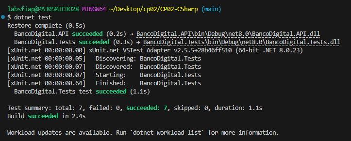
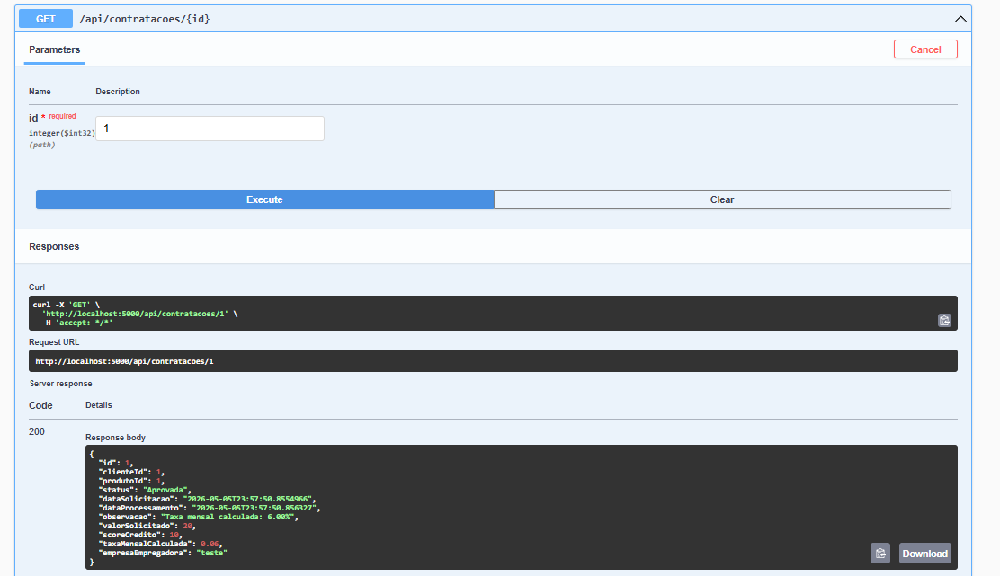

# Banco Digital API

## 1. Identificação

| Nome | RM |
|---|---|
| André Nakamatsu Rocha | RM555004 |
| Matheus Rivera Montovaneli | RM555499 |
| João Marcelo Furtado Romero | RM555199 |

---

## 2. Produto bancário escolhido e justificativa

Implementamos **dois produtos**, conforme escopo de trio:

**Empréstimo Pessoal** — produto de crédito com regra de negócio de cálculo de taxa de juros mensal baseada no score de crédito do cliente. Escolhido por representar o produto mais completo em termos de lógica financeira e validação de dados.

**Receber Salário** — produto de domicílio bancário com validação de convênio com empresa empregadora. Escolhido por exigir uma regra de negócio distinta (validação de lista de convênios), complementando bem o Empréstimo.

O terceiro produto, **Maquininha de Cartão**, está presente no diagrama de classes e no modelo de dados, mas não possui endpoints implementados, conforme permitido pelo enunciado para trios.

---

## 3. Modelagem de filas

Este projeto **não utiliza mensageria assíncrona**. O processamento das contratações é feito de forma **síncrona**: ao receber um `POST /api/contratacoes`, a API aplica imediatamente a regra de negócio do produto (cálculo de taxa ou validação de convênio), persiste a contratação com status `Aprovada` ou `Reprovada` e retorna `201 Created` com o resultado.

Essa decisão simplifica o fluxo sem comprometer a corretude do domínio, mantendo rastreabilidade completa via `DataProcessamento` e `Observacao` em cada contratação.

---

## 4. Diagrama de Classes


---

## 5. Como rodar localmente

### Pré-requisitos

- [.NET 8 SDK](https://dotnet.microsoft.com/download/dotnet/8)
- Acesso à rede FIAP (Oracle `oracle.fiap.com.br:1521/ORCL`)

### Configurar credenciais

Edite `BancoDigital.API/appsettings.json` e preencha seu RM e senha:

```json
{
  "ConnectionStrings": {
    "OracleConnection": "Data Source=oracle.fiap.com.br:1521/ORCL;User Id=SEU_RM;Password=SUA_SENHA;"
  }
}
```

### Aplicar migrations

```bash
cd BancoDigital.API
dotnet ef database update
```

### Rodar a API

```bash
dotnet run
```

A API estará disponível em `https://localhost:5001` (ou `http://localhost:5000`).  
O Swagger estará em: `http://localhost:5000/swagger`

---

## 6. Endpoints disponíveis

### POST `/api/agencias` — Cadastrar agência

**Request:**
```json
{
  "nome": "Agência Centro",
  "endereco": "Av. Paulista, 1000",
  "numero": "001"
}
```

**Response `201 Created`:**
```json
{
  "id": 1,
  "nome": "Agência Centro",
  "endereco": "Av. Paulista, 1000",
  "numero": "001"
}
```

---

### GET `/api/agencias/{id}` — Buscar agência

**Response `200 OK`:**
```json
{
  "id": 1,
  "nome": "Agência Centro",
  "endereco": "Av. Paulista, 1000",
  "numero": "001"
}
```

---

### POST `/api/clientes/pf` — Cadastrar Pessoa Física

**Request:**
```json
{
  "nome": "João Silva",
  "email": "joao@email.com",
  "telefone": "11999999999",
  "agenciaId": 1,
  "cpf": "111.111.111-11",
  "dataNascimento": "1990-05-15"
}
```

**Response `201 Created`:**
```json
{
  "id": 1,
  "nome": "João Silva",
  "email": "joao@email.com",
  "telefone": "11999999999",
  "tipo": "PF",
  "agenciaId": 1,
  "agenciaNome": "Agência Centro",
  "cpf": "111.111.111-11",
  "dataNascimento": "1990-05-15T00:00:00",
  "cnpj": null,
  "razaoSocial": null
}
```

**Erros:**
- `404` — agência não encontrada
- `400` — CPF já cadastrado

---

### POST `/api/clientes/pj` — Cadastrar Pessoa Jurídica

**Request:**
```json
{
  "nome": "Empresa X",
  "email": "contato@empresax.com",
  "telefone": "1133334444",
  "agenciaId": 1,
  "cnpj": "00.000.000/0001-00",
  "razaoSocial": "Empresa X Ltda"
}
```

**Response `201 Created`:**
```json
{
  "id": 2,
  "nome": "Empresa X",
  "email": "contato@empresax.com",
  "telefone": "1133334444",
  "tipo": "PJ",
  "agenciaId": 1,
  "agenciaNome": "Agência Centro",
  "cpf": null,
  "dataNascimento": null,
  "cnpj": "00.000.000/0001-00",
  "razaoSocial": "Empresa X Ltda"
}
```

---

### GET `/api/clientes/{id}` — Buscar cliente

**Response `200 OK`:** (mesmo formato acima, incluindo dados da agência)

---

### POST `/api/contratacoes` — Solicitar contratação

**Request — Empréstimo (ProdutoId = 1):**
```json
{
  "clienteId": 1,
  "produtoId": 1,
  "valorSolicitado": 15000.00,
  "scoreCredito": 850,
  "empresaEmpregadora": null
}
```

**Response `201 Created`:**
```json
{
  "id": 1,
  "clienteId": 1,
  "produtoId": 1,
  "status": "Aprovada",
  "dataSolicitacao": "2026-05-05T23:40:00Z",
  "dataProcessamento": "2026-05-05T23:40:00Z",
  "observacao": "Taxa mensal calculada: 1,50%",
  "valorSolicitado": 15000.00,
  "scoreCredito": 850,
  "taxaMensalCalculada": 0.0150,
  "empresaEmpregadora": null
}
```

**Request — Receber Salário (ProdutoId = 2):**
```json
{
  "clienteId": 1,
  "produtoId": 2,
  "valorSolicitado": null,
  "scoreCredito": null,
  "empresaEmpregadora": "FIAP"
}
```

**Response `201 Created`:**
```json
{
  "id": 2,
  "clienteId": 1,
  "produtoId": 2,
  "status": "Aprovada",
  "dataSolicitacao": "2026-05-05T23:41:00Z",
  "dataProcessamento": "2026-05-05T23:41:00Z",
  "observacao": "Convênio validado para empresa: FIAP",
  "valorSolicitado": null,
  "scoreCredito": null,
  "taxaMensalCalculada": null,
  "empresaEmpregadora": "FIAP"
}
```

**Erros:**
- `404` — cliente ou produto não encontrado
- `400` — empresa sem convênio (ReceberSalario)

---

### GET `/api/contratacoes/{id}` — Consultar status

**Response `200 OK`:** (mesmo formato acima)

---

## 7. Testes

```bash
cd BancoDigital.Tests
dotnet test
```

### Casos cobertos

| Teste | Cenário |
|---|---|
| `CriarPF_CpfDuplicado_Retorna400` | CPF já cadastrado |
| `CriarPJ_CnpjDuplicado_Retorna400` | CNPJ já cadastrado |
| `CriarPF_AgenciaInexistente_Retorna404` | Agência não existe |
| `SolicitarContratacaoEmprestimo_ScoreAlto_TaxaCorreta` | Score 850 → taxa 1,5% |
| `SolicitarContratacao_ClienteInexistente_Retorna404` | Cliente não existe |
| `SolicitarContratacaoReceberSalario_EmpresaInvalida_Retorna400` | Empresa sem convênio |
| `ConsultarContratacao_RetornaStatusAprovada` | Status correto após criação |

### Print do resultado

> 
---

## 8. Print da API no Swagger

> 

---